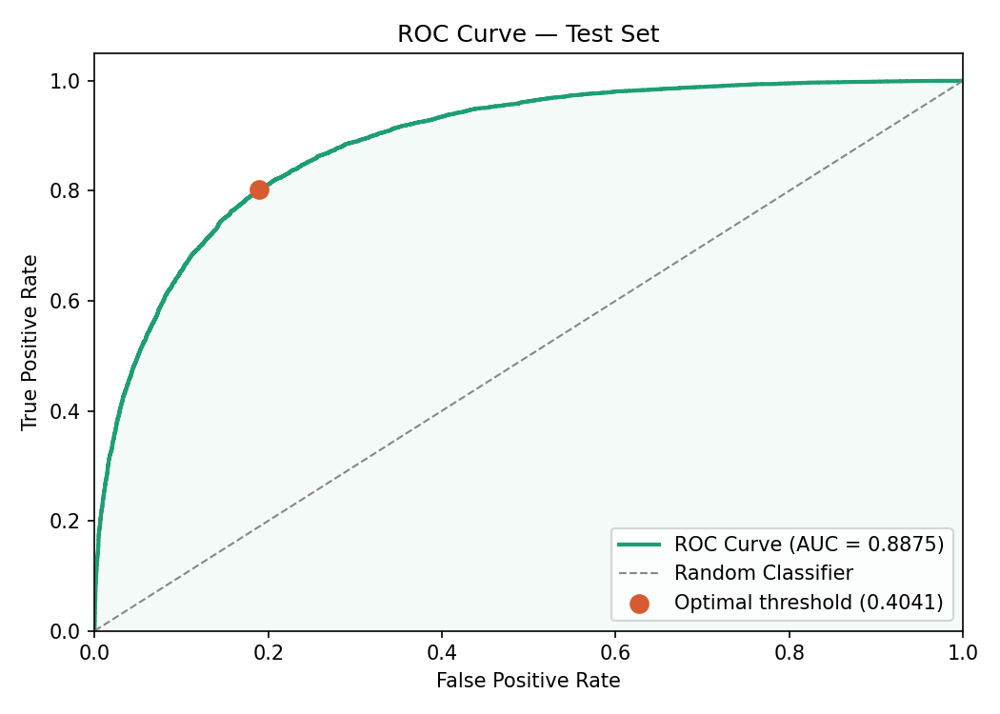
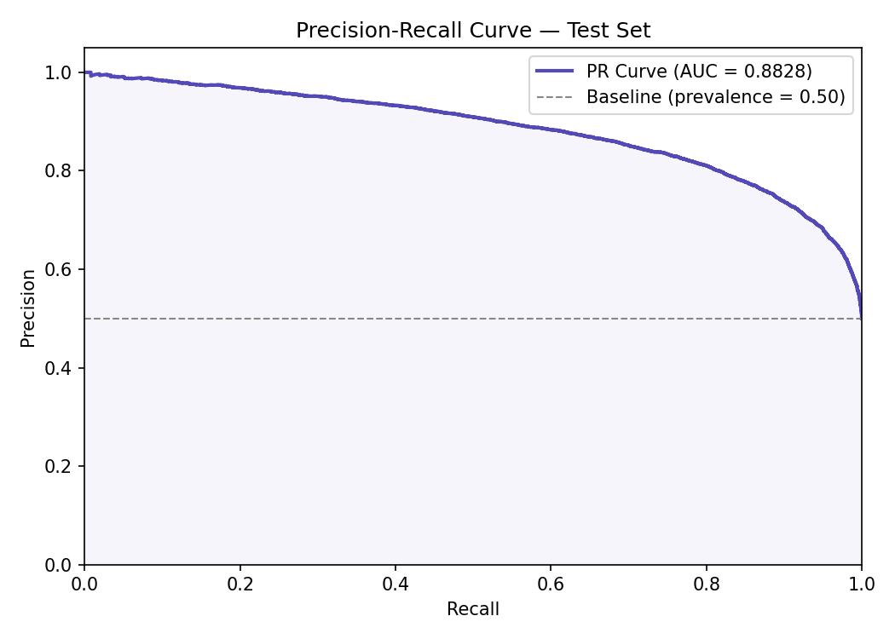
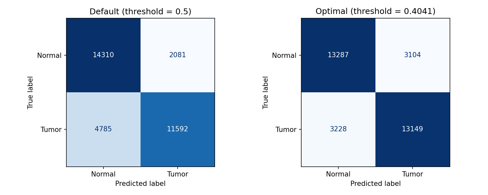
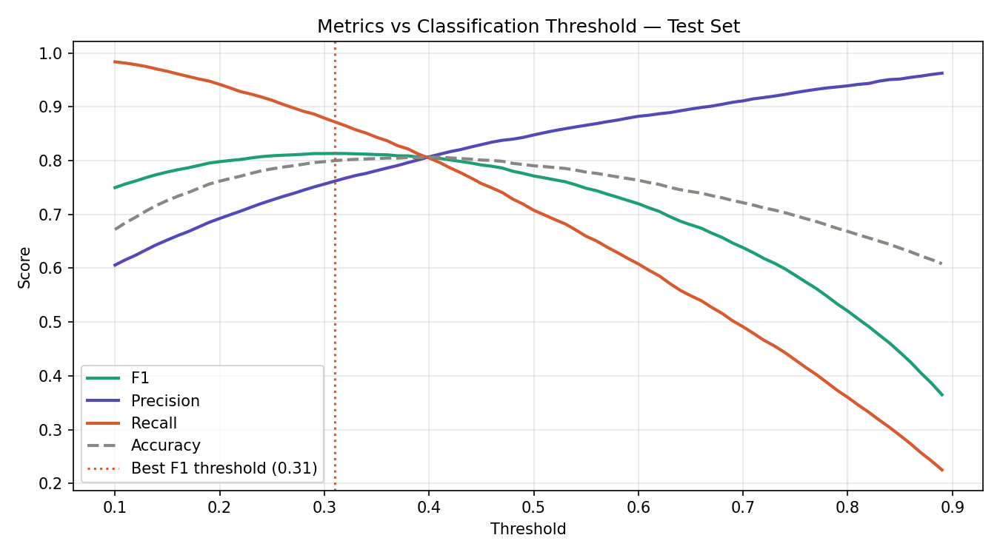
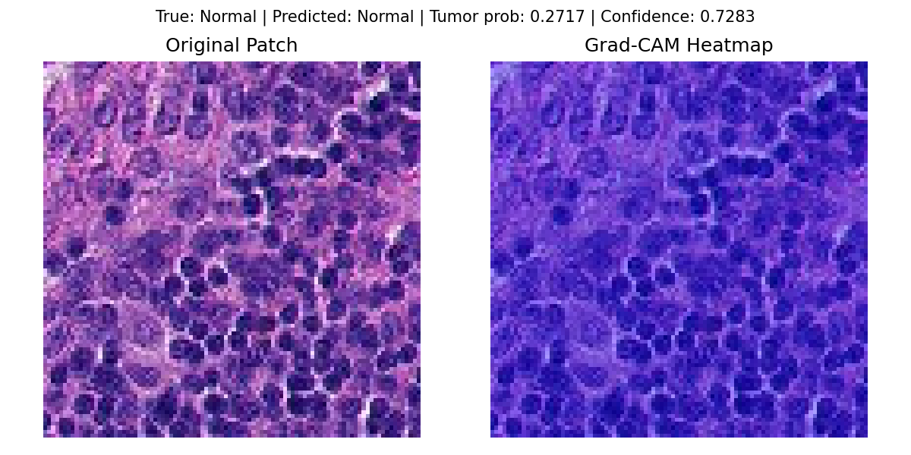
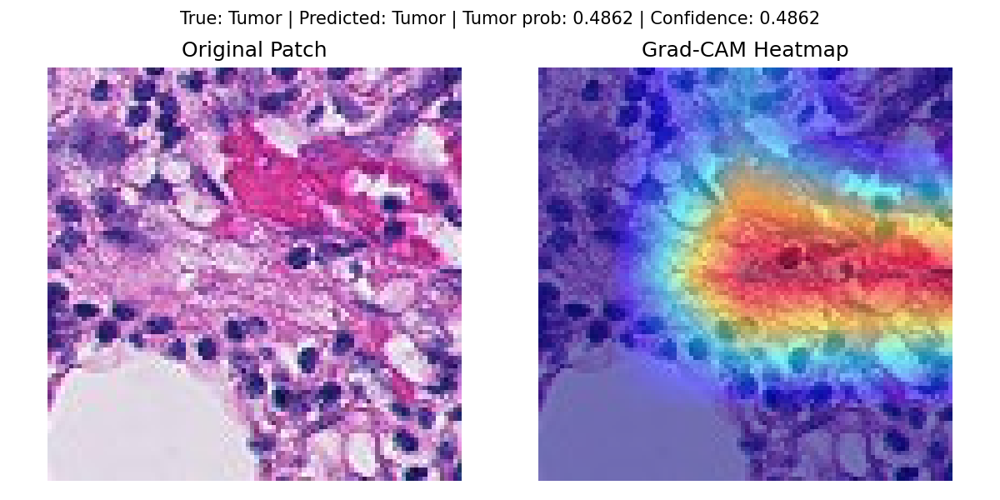

# Histopathology Cancer Detector

An explainable deep learning system for histopathology patch classification using EfficientNet-B0 and Grad-CAM. This repository includes model training, test evaluation, a FastAPI prediction API, and a Streamlit user interface for interactive visualization.

---

##  Project Overview

- **Goal:** Detect tumor tissue in histopathology image patches and provide visual explanations using Grad-CAM.
- **Architecture:** Fine-tuned `EfficientNet-B0` with a custom binary classifier head.
- **Dataset:** PatchCamelyon (PCam) patch dataset stored locally in `data/pcam/`.
- **Explainability:** Grad-CAM heatmaps overlayed on 96×96 image patches.
- **Serving stack:** `FastAPI` for model inference and `Streamlit` for interactive visualization.

---

##  Repository Structure

- `api/` — FastAPI backend and Grad-CAM inference logic
- `app/` — Streamlit frontend and pages
- `model/` — training, evaluation, and testing scripts
- `assets/plots/` — generated model evaluation plots
- `assets/samples/` — example patch images and Grad-CAM visualizations
- `data/` — local dataset split files and metadata
- `model/weights/` — saved model weights and training history

---

##  Test Metrics

The model was evaluated on the PCam test set using both a default threshold of `0.50` and an optimal threshold found via Youden’s J statistic.

### Best Test Performance (Optimal Threshold)

| Metric | Result |
|---|---|
| Threshold | `0.4041` |
| AUC-ROC | `0.8875` |
| AUC-PR | `0.8828` |
| Accuracy | `0.8068` |
| F1 Score | `0.8059` |
| Precision | `0.8090` |
| Recall | `0.8029` |
| Confusion Matrix | TN=13287, FP=3104, FN=3228, TP=13149 |

### Default Threshold Performance (`0.50`)

| Metric | Result |
|---|---|
| AUC-ROC | `0.8875` |
| AUC-PR | `0.8828` |
| Accuracy | `0.7905` |
| F1 Score | `0.7715` |
| Precision | `0.8478` |
| Recall | `0.7078` |
| Confusion Matrix | TN=14310, FP=2081, FN=4785, TP=11592 |

---

##  Evaluation Plots









---

##  Grad-CAM Samples

These representative Grad-CAM outputs demonstrate model attention on normal and tumor patches.

| Normal Patch | Tumor Patch |
|---|---|
|  |  |

---

##  Installation

```bash
cd histopath-cancer-detector
python -m venv .venv
.\.venv\Scripts\Activate.ps1
pip install -r requirements.txt
```

> Ensure the local dataset splits exist under `data/pcam/` before training or testing.

---

## ▶ Running the API

```bash
.\.venv\Scripts\Activate.ps1
uvicorn api.main:app --reload --host 0.0.0.0 --port 8000
```

Then open:
- `http://localhost:8000/docs` for FastAPI documentation
- `http://localhost:8000/api/v1/predict` to test image upload predictions

---

##  Running the Streamlit Frontend

```bash
.\.venv\Scripts\Activate.ps1
streamlit run app/home.py
```

The app allows image upload, tumor classification, and Grad-CAM visualization.

---

##  Model Testing

To generate or refresh test metrics and plots:

```bash
.\.venv\Scripts\Activate.ps1
python model/test.py
```

This script produces:
- `model/weights/test_metrics.json`
- `assets/plots/test_roc_curve.png`
- `assets/plots/test_precision_recall_curve.png`
- `assets/plots/test_confusion_matrices.png`
- `assets/plots/test_threshold_sweep.png`

---

##  Model and Inference Details

- Model weights: `model/weights/best_model.pth`
- Grad-CAM integration: `api/gradcam.py`
- Prediction endpoint: `api/routes.py`
- Test evaluation script: `model/test.py`
- Training history: `model/weights/history.json`

---

##  Notes

- The repository is intended for **research and demonstration purposes only**.
- It is **not a clinical diagnostic tool**.
- Grad-CAM helps explain where the network focuses, but final decisions should always be reviewed by experts.

---

##  References

- PatchCamelyon (PCam) dataset
- EfficientNet-B0 backbone
- Grad-CAM explainability

---

##  Suggested Workflow

1. Install dependencies.
2. Prepare the dataset in `data/pcam/`.
3. Train or load the pre-trained model.
4. Run `model/test.py` to confirm metrics.
5. Start the API.
6. Launch Streamlit and inspect Grad-CAM outputs.
